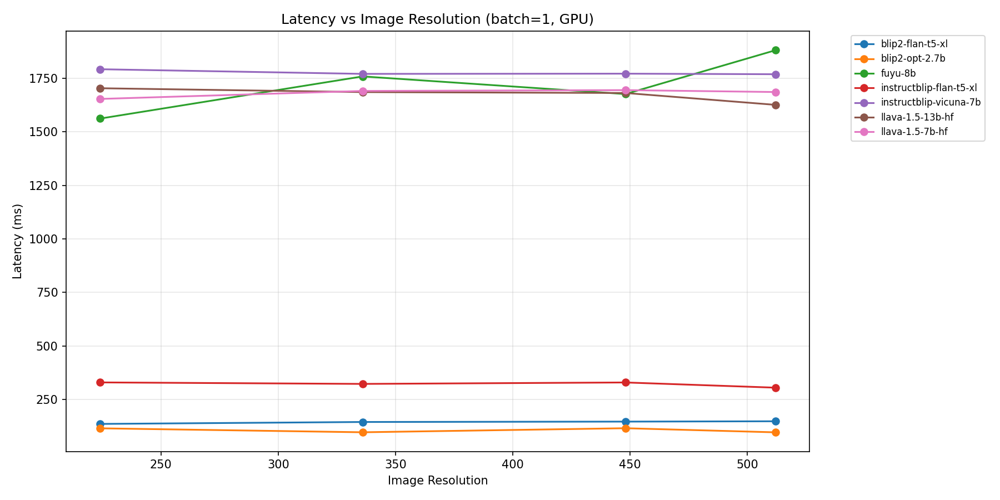
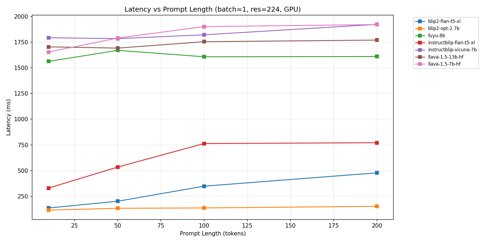
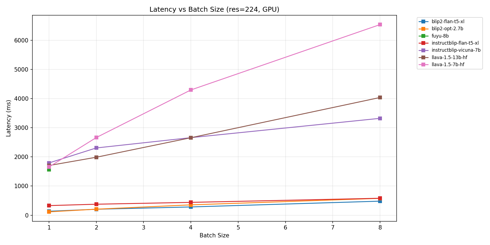
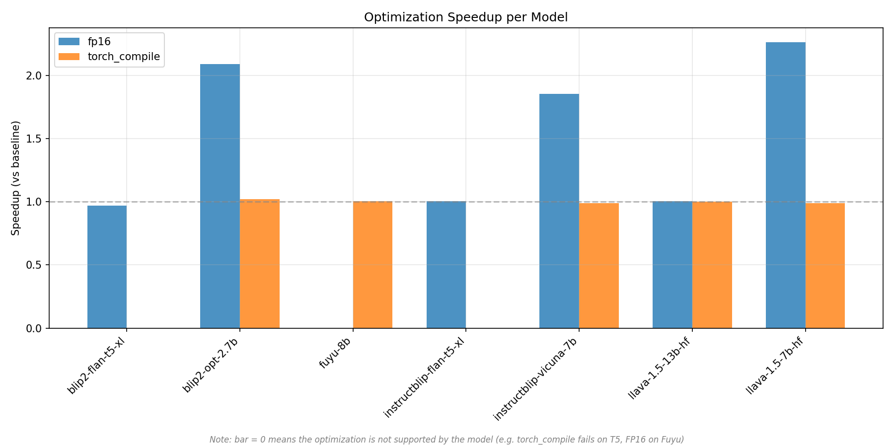
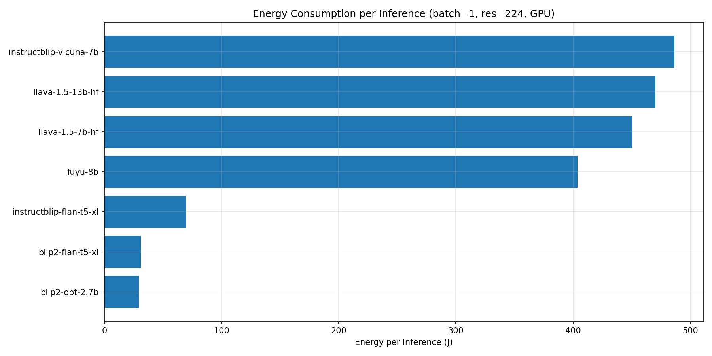
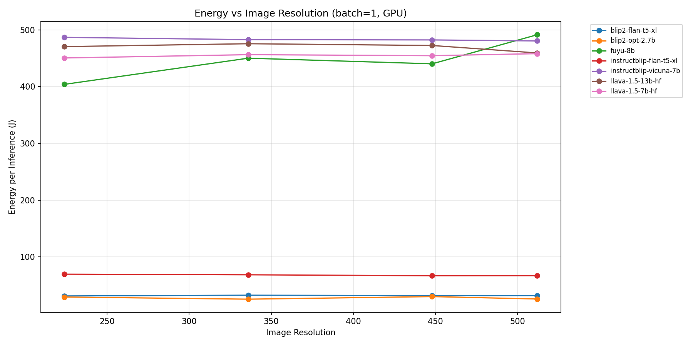
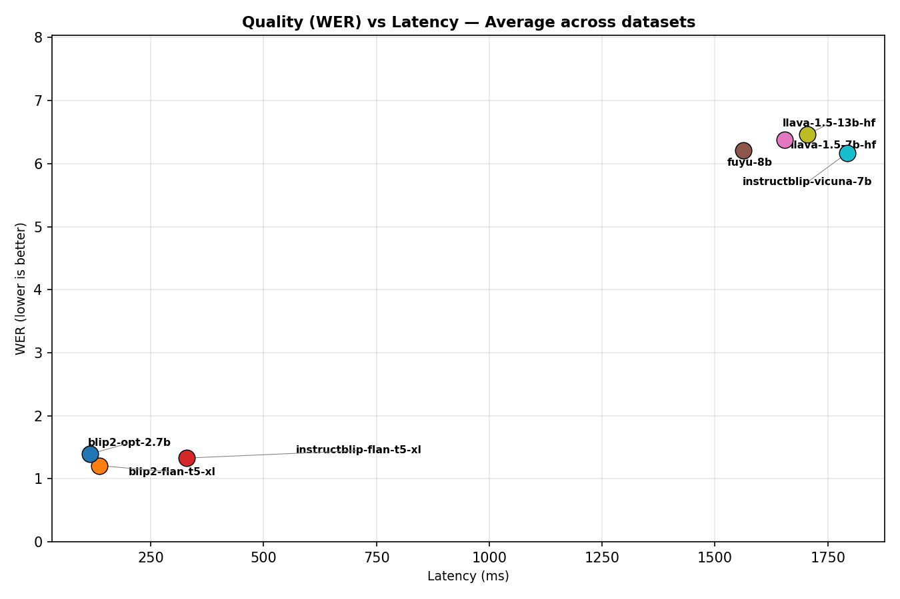
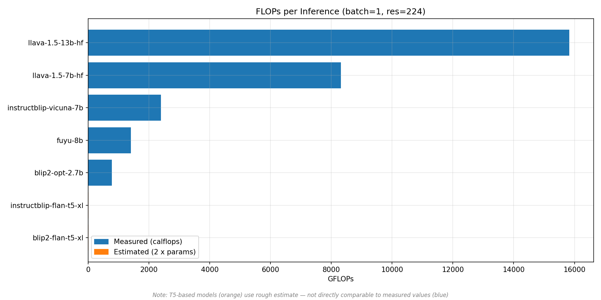
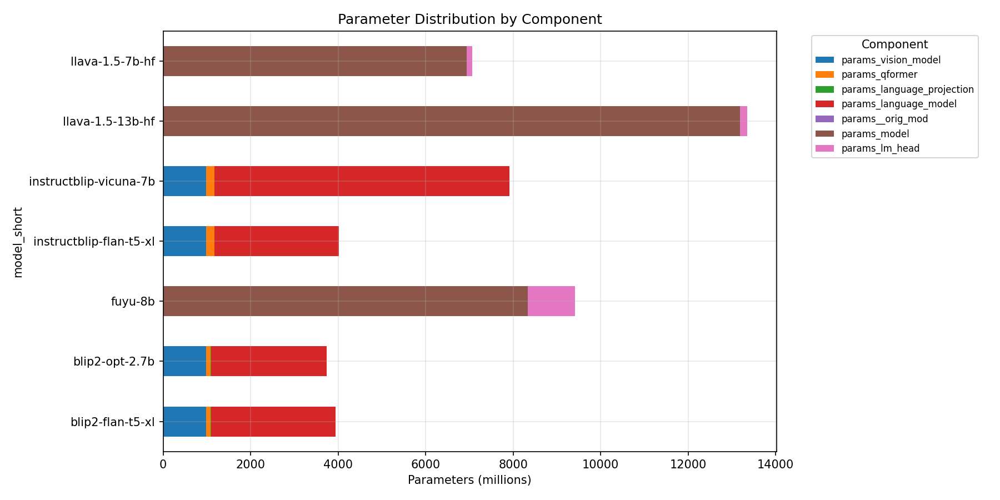
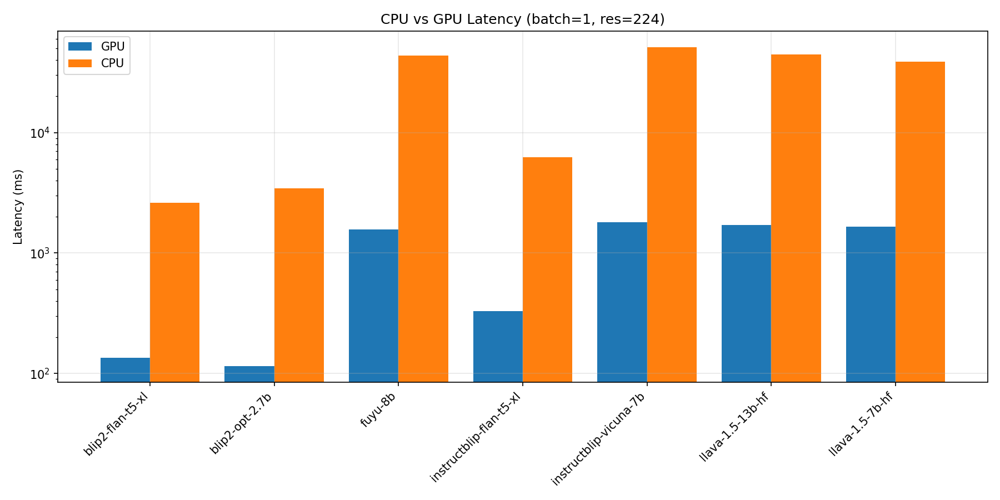

# VLM Profiler Report

## Baseline Comparison (batch=1, res=224, GPU)

| Model                   |   Latency (ms) |   WER |   Energy (J/inf) |             FLOPs | Params   |
|:------------------------|---------------:|------:|-----------------:|------------------:|:---------|
| blip2-opt-2.7b          |          78.72 |  5.63 |            20.54 |   752000000000.00 | 3745M    |
| blip2-flan-t5-xl        |         134.17 |  1.75 |            30.91 |     7880000000.00 | 3942M    |
| instructblip-flan-t5-xl |         315.39 |  1.84 |            68.15 |     8050000000.00 | 4023M    |
| idefics2-8b             |         915.45 |  9.26 |           243.97 |    16800000000.00 | 8403M    |
| fuyu-8b                 |        1233.50 | 10.21 |           320.62 |  1400000000000.00 | 9408M    |
| llava-1.5-13b-hf        |        1667.93 | 13.35 |           458.62 | 15800000000000.00 | 13351M   |
| llava-1.5-7b-hf         |        1791.62 | 12.86 |           470.05 |  8330000000000.00 | 7063M    |
| instructblip-vicuna-7b  |        1902.07 |  5.31 |           502.19 |  2400000000000.00 | 7914M    |

## Quality (WER) by Dataset

| model_short             |   coco_caption |   scienceqa |   textvqa |
|:------------------------|---------------:|------------:|----------:|
| blip2-flan-t5-xl        |           0.79 |        2.85 |      1.60 |
| blip2-opt-2.7b          |           0.89 |        8.76 |      4.13 |
| fuyu-8b                 |           4.97 |       16.12 |      9.55 |
| idefics2-8b             |           2.24 |       16.83 |      8.69 |
| instructblip-flan-t5-xl |           2.09 |        2.59 |      0.86 |
| instructblip-vicuna-7b  |           0.96 |        9.49 |      5.47 |
| llava-1.5-13b-hf        |           3.79 |       24.71 |     11.54 |
| llava-1.5-7b-hf         |           3.80 |       22.55 |     12.24 |

## Latency vs Image Resolution

## Latency vs Prompt Length

## Latency vs Batch Size

## Optimization Speedup (FP16, torch.compile)

## Energy per Inference

## Energy vs Resolution

## Quality (WER) vs Latency

## FLOPs Comparison

## Parameter Distribution by Component

## CPU vs GPU Latency

## Comparison with Official Paper Results

### Important Methodology Notes

Our profiler measures **WER (Word Error Rate)** — lower is better. Papers report **accuracy** (%) — higher is better.
These are **not directly comparable** metrics, but we can verify:
1. **Ranking consistency**: do models rank in the same relative order?
2. **Sanity check**: are our WER values plausible given paper accuracy?

Our setup: 300 samples per dataset, zero-shot, greedy decoding, 224x224 resolution, max 10 new tokens.
Paper setups vary: different sample sizes (full test sets), beam search, sometimes task-specific fine-tuning, higher resolutions.

### Official Accuracy from Papers (zero-shot unless noted)

| Model | TextVQA | ScienceQA (img) | VQAv2 | Source |
|-------|---------|-----------------|-------|--------|
| BLIP-2 OPT-2.7B | — | — | 53.5 | Li et al. 2023, Table 2 |
| BLIP-2 FlanT5-XL | — | — | 63.0 | Li et al. 2023, Table 2 |
| InstructBLIP FlanT5-XL | 46.6 | 70.4 | — | Dai et al. 2023, Table 1 |
| InstructBLIP Vicuna-7B | 50.1 | 60.5 | — | Dai et al. 2023, Table 1 |
| LLaVA-1.5 7B | 58.2 | 66.8 | 78.5* | Liu et al. 2023, Table 3 (*fine-tuned) |
| LLaVA-1.5 13B | 61.3 | 71.6 | 80.0* | Liu et al. 2023, Table 3 (*fine-tuned) |
| Idefics2-8B (base, 8-shot) | 57.9 | — | 70.3 | Laurençon et al. 2024, Table 8 |
| Idefics2-8B (instruct, 0-shot) | 70.4 | — | — | Laurençon et al. 2024, Table 9 |
| Fuyu-8B | — | — | 74.2 | Adept blog post |

Note: BLIP-2 paper does not report TextVQA or ScienceQA. Fuyu blog reports only VQAv2, OKVQA, COCO CIDEr, AI2D.

### Our WER Results vs Paper Rankings

**TextVQA** (papers report accuracy; our WER — lower = better):

| Model | Paper Acc (%) | Our WER | Ranking Match? |
|-------|--------------|---------|----------------|
| InstructBLIP FlanT5-XL | 46.6 | **0.86** | Best in our test too |
| InstructBLIP Vicuna-7B | 50.1 | 5.47 | |
| BLIP-2 FlanT5-XL | — | 1.60 | |
| BLIP-2 OPT-2.7B | — | 4.13 | |
| Idefics2-8B | 57.9–70.4 | 8.69 | Worse than expected |
| LLaVA-1.5 7B | 58.2 | 12.24 | Worse than expected |
| LLaVA-1.5 13B | 61.3 | 11.54 | Worse than expected |
| Fuyu-8B | — | 9.55 | |

**ScienceQA** (papers report accuracy; our WER):

| Model | Paper Acc (%) | Our WER | Ranking Match? |
|-------|--------------|---------|----------------|
| InstructBLIP FlanT5-XL | 70.4 | **2.59** | Best — matches paper |
| InstructBLIP Vicuna-7B | 60.5 | 9.49 | |
| BLIP-2 FlanT5-XL | — | 2.85 | |
| BLIP-2 OPT-2.7B | — | 8.76 | |
| LLaVA-1.5 7B | 66.8 | 22.55 | Worst — contradicts paper |
| LLaVA-1.5 13B | 71.6 | 24.71 | Worst — contradicts paper |
| Idefics2-8B | — | 16.83 | |
| Fuyu-8B | — | 16.12 | |

### Analysis

**What matches papers:**
- **FlanT5 models dominate** on TextVQA and ScienceQA in our results, consistent with InstructBLIP paper showing strong short-answer performance
- **InstructBLIP > BLIP-2** on quality, confirming instruction tuning helps
- **FlanT5-XL > OPT-2.7B** within same family, matching BLIP-2 paper's finding that "FlanT5 outperforms OPT"

**What diverges from papers:**
- **LLaVA-1.5 ranks worst** in our test despite being best in papers (58–61% TextVQA accuracy). Root cause: our max_new_tokens=10 severely penalizes LLaVA, which generates verbose conversational answers ("The answer is X because..."). WER explodes when comparing a long response to a short reference. LLaVA was designed for conversational output, not terse answers.
- **Idefics2 underperforms** — same issue: decoder-only models with conversational fine-tuning produce longer responses that inflate WER.
- **BLIP-2/InstructBLIP FlanT5 look artificially good** — encoder-decoder T5 models naturally produce short, terse answers that match reference format, giving them a WER advantage unrelated to actual understanding.

**Key takeaway:** WER is a format-sensitive metric. Models tuned for short answers (FlanT5-based) score better on WER than models tuned for natural conversation (LLaVA, Idefics2), even when the latter have higher actual accuracy on standard benchmarks. For a fair quality comparison, exact-match or VQA-accuracy metrics with answer extraction would be more appropriate.

## Known Limitations

### Model-specific incompatibilities

| Model | Issue | Affected experiments |
|-------|-------|---------------------|
| adept/fuyu-8b | FP16 causes dtype mismatch (Float vs Half) | 3 (fp16 x 3 datasets) |
| adept/fuyu-8b | Processor returns lists for batched inputs | 9 (batch>1 x 3 datasets) |
| blip2-flan-t5-xl | torch.compile fails (T5 architecture) | 3 (torch_compile x 3 datasets) |
| instructblip-flan-t5-xl | torch.compile fails (T5 architecture) | 3 (torch_compile x 3 datasets) |

### Other notes

- **Resolution scaling is flat** for BLIP2/InstructBLIP — they resize internally to fixed vision encoder resolution
- **FLOPs**: exact measurement (calflops) only for some models; T5-based use rough estimate (2 x params)
- **FP16 can be slower** on T5-based models due to internal dtype casting overhead
