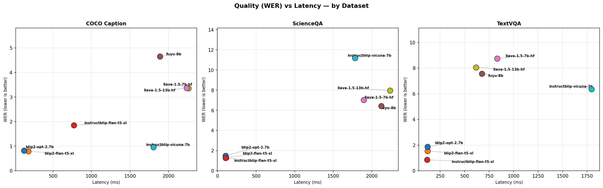

# VLM Profiler Report

## Baseline Comparison (batch=1, res=224, GPU)

| Model                   |   Latency (ms) |   WER |   Energy (J/inf) |             FLOPs | Params   |
|:------------------------|---------------:|------:|-----------------:|------------------:|:---------|
| blip2-opt-2.7b          |         115.24 |  1.39 |            29.34 |   773000000000.00 | 3745M    |
| blip2-flan-t5-xl        |         135.75 |  1.21 |            31.21 |     7880000000.00 | 3942M    |
| instructblip-flan-t5-xl |         329.69 |  1.33 |            69.56 |     8050000000.00 | 4023M    |
| fuyu-8b                 |        1562.25 |  6.21 |           403.91 |  1380000000000.00 | 9408M    |
| llava-1.5-7b-hf         |        1654.08 |  6.38 |           450.39 |  8290000000000.00 | 7063M    |
| llava-1.5-13b-hf        |        1704.07 |  6.46 |           470.38 | 15800000000000.00 | 13351M   |
| instructblip-vicuna-7b  |        1792.87 |  6.17 |           486.71 |  2370000000000.00 | 7914M    |

## Quality (WER) by Dataset

| model_short             |   coco_caption |   scienceqa |   textvqa |
|:------------------------|---------------:|------------:|----------:|
| blip2-flan-t5-xl        |           0.79 |        1.30 |      1.54 |
| blip2-opt-2.7b          |           0.82 |        1.49 |      1.87 |
| fuyu-8b                 |           4.65 |        6.42 |      7.57 |
| instructblip-flan-t5-xl |           1.85 |        1.28 |      0.86 |
| instructblip-vicuna-7b  |           0.96 |       11.18 |      6.36 |
| llava-1.5-13b-hf        |           3.36 |        7.96 |      8.06 |
| llava-1.5-7b-hf         |           3.37 |        7.02 |      8.75 |

## Latency vs Image Resolution

## Latency vs Prompt Length

## Latency vs Batch Size

## Optimization Speedup (FP16, torch.compile)

## Energy per Inference

## Energy vs Resolution

## Quality (WER) vs Latency — by Dataset

## FLOPs Comparison

## Parameter Distribution by Component

## CPU vs GPU Latency

## Known Limitations

### Model-specific incompatibilities

| Model | Issue | Affected experiments |
|-------|-------|---------------------|
| adept/fuyu-8b | FP16 causes dtype mismatch (Float vs Half) | 3 (fp16 x 3 datasets) |
| adept/fuyu-8b | Processor returns lists for batched inputs | 9 (batch>1 x 3 datasets) |
| blip2-flan-t5-xl | torch.compile fails (T5 architecture) | 3 (torch_compile x 3 datasets) |
| instructblip-flan-t5-xl | torch.compile fails (T5 architecture) | 3 (torch_compile x 3 datasets) |

### Other notes

- **Resolution scaling is flat** for BLIP2/InstructBLIP — they resize internally to fixed vision encoder resolution
- **FLOPs**: exact measurement (calflops) only for some models; T5-based use rough estimate (2 x params)
- **FP16 can be slower** on T5-based models due to internal dtype casting overhead
